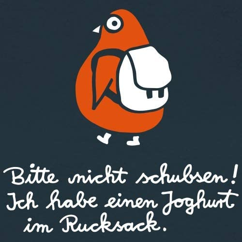

# Penguin

You friendly companion, protects you from being nudged hard. Whether in the schoolyard, the university, even in a Random House. Simply everywhere.

## What the actual...?

Undoubtedly, the penguin is the most sympathetic of all birds. Other birds you have to laboriously acquire and maintain, some does not even come with a decent manual. The penguin on the other hand, is always there for you; from the beginning. He is at your service, anytime. Maybe you don't even think about it anymore, but he is the one keeping you work kernel going, protecting you from deadlocks, memory-leaks and other hazardous quack, keeping the user-space safe.

## Yeah ... get to the point

Okay, okay. Imagine you're getting nudged for a specifc thing over and over again. Imagine, just for illustration: A whole semester long. Maybe you know the feeling when you when you them deny to do what others want you to do. Even if it would be the best and most pragmatic solution for you and everyone else. And to make the scenario even more vivid: Imagine furthermore all of this is about something with birds. Specific birds. Falcons? Yeah I guess, it was something with falcons.

The penguin socializes and takes care of the communication for you, even if you just made it harder for everyone. Effortlessly he mediates between sailboats, birds and the cloud-borns. You can just focus on what you want. And you will find yourself satisfied. In harmony with the environment and the green forest.
